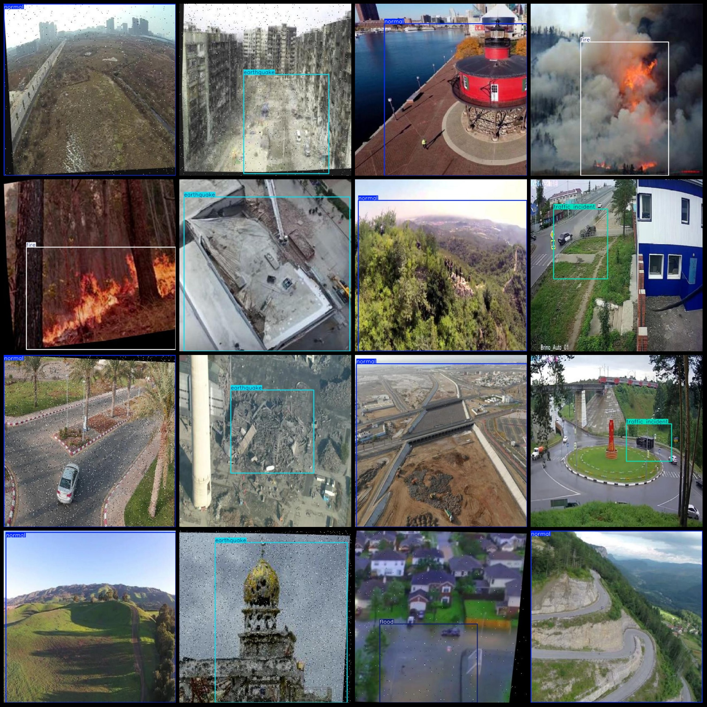
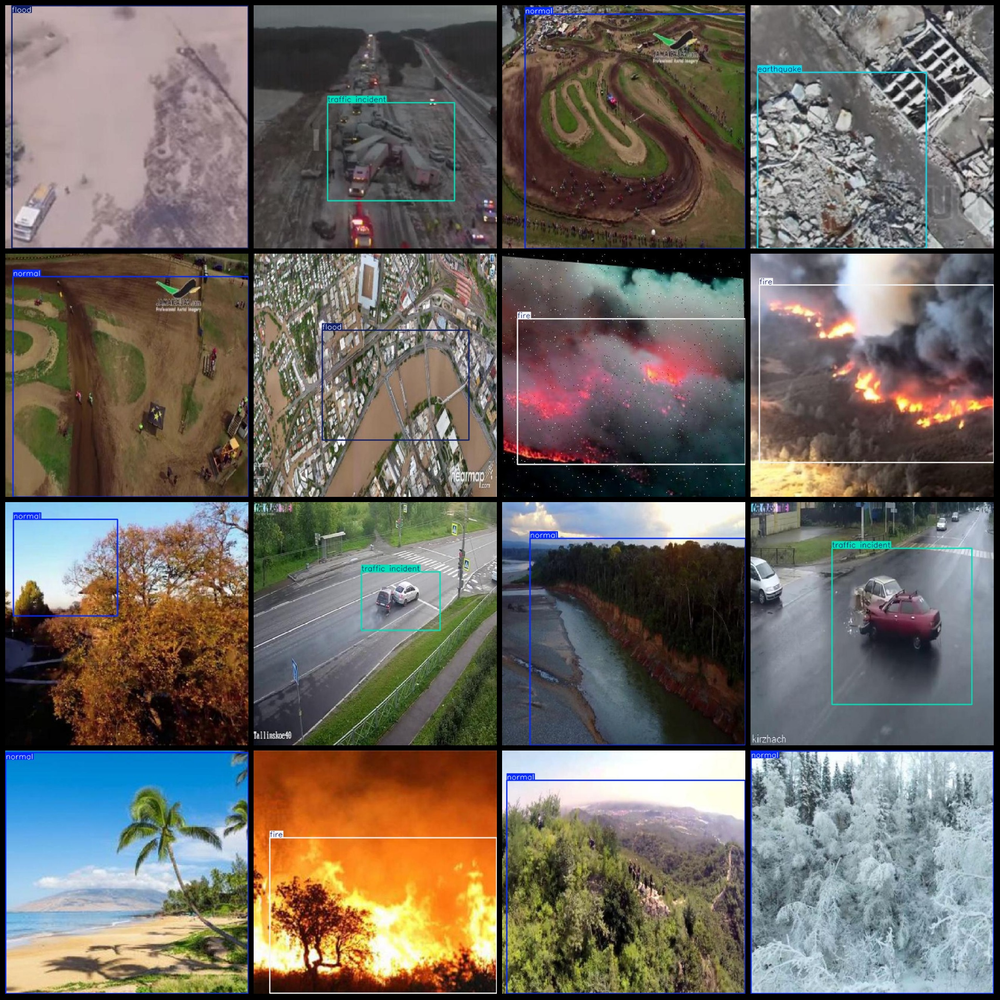

# Natural Disasters and Traffic Accidents Drone Detection Dataset VOC+YOLO Format 372 Categories

Dataset format: Pascal VOC format + YOLO format (without split path in txt file, only containing jpg images and corresponding VOC format xml files and YOLO format txt files)
Number of images (jpg file count): 372
Number of annotations (xml file count): 372
Number of annotations (txt file count): 372
Number of annotation categories: 5
Annotation category names (note that the order of labels in YOLO format does not correspond to this, but is based on classes.txt in the labels folder): ["earthquake", "fire", "flood", "normal", "traffic incident"]
Number of bounding boxes for each category:
Earthquake = 46
Fire = 53
Flood = 38
Normal = 170
Traffic Incident = 80
Total bounding box count: 387
Image resolution: 640x640
Annotation tool used: labelImg
Annotation rules: draw bounding boxes for categories
Important note: No warranty is given regarding the accuracy of the trained models or weight files.
Image preview:
## Image

Here is a pay link on Stripe ( https://buy.stripe.com/3cs8yP7sY87d0vu9AB ). Please contact me lonlonago@foxmail.com after funding $89, and I will send you a complete data files , thank you!

